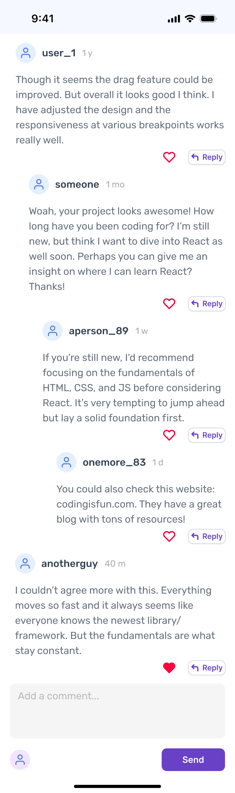
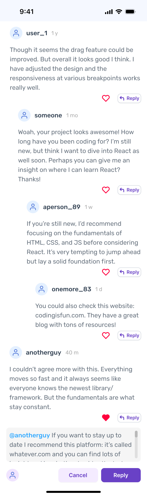

## Skoove Mobile Engineer Coding Challenge (React Native)

Thanks a lot for taking the time for this challenge and for applying at Skoove. Your assignment consists of writing the code for a mockup design in Figma, representing a system of nested comments with replies. This coding challenge is designed to evaluate your engineering skills, focusing on technical proficiency and system design.

### User Story
As a Skoove user, I want to engage with a community platform that allows me to easily read, post, and interact with comments in a structured and user-friendly way.

### Figma Deliverables
You can find figma file in the root of the project [skoove-mockups.fig](skoove-mockups.fig) and upload it to figma to see the design.

| Comments display 1                                   | Comments display 2                                   |
|------------------------------------------------------|------------------------------------------------------|
|  |  |

### Functional Requirements

- [ ] **Nested comment system display:** The comment system should be displayed in a nested structure as illustrated in the Figma file
- [ ] **Handling high volume of comments:** Although the platform currently doesn't frequently encounter a high volume of comments, consider optimizations to cover edge cases with a big number of comments, preventing overloading the user interface. Suggest possible optimization strategies in the [document](PROGRESS.md) for future discussion
- [ ] **Comment submission form:** 
    - [ ] Users must be able to add comments by submitting a form
    - [ ] There is no validation for comments; users can enter any text without character limits or validation checks
    - [ ] Comments are restricted to textual format only
    - [ ] When a user clicks the 'Reply' button on a comment, the same form should be displayed with two buttons: 'Reply' and 'Cancel'
    - [ ] 'Cancel' button should reset the form to its initial state, allowing users to add a new comment instead of replying
    - [ ] The form should automatically include the username of the user being replied to, as a reference in the reply
- [ ] **Handling deeply nested comments:** The Figma mockup limits the number of nested comments. Consider and propose UX/UI solutions for replying to comments beyond this limit. Ideas can be noted in the [document](PROGRESS.md). The implementation in code is not mandatory. We leave it up to you
- [ ] **Timestamp on comments:** Each comment should display a timestamp indicating when it was created, like '1 day ago', '2 days ago', etc
- [ ] **After refresh behavior:** After refreshing the app (close the app and open again), it is acceptable if newly added comments are not saved and only the mock data comments are displayed
- [ ] **Comment reactions:** Each comment has a simple 'Like' button with two states
- [ ] **Language Support:** The platform should support English only, with no requirement for other languages

### Non-functional Requirements

- [ ] **Device compatibility:** The application should work on both iOS & Android devices with support for the latest versions. It also should work and look good on small devices (ex: iphone X, iphone SE)
- [ ] **Configurability:** Ensure that components are designed for easy configurability, anticipating future changes
- [ ] **Comments structure and scalability**: When designing the comments structure, keep in mind the potential for a high volume of comments. Try to implement a scalable architecture from the start, optimized for handling a large number of comments efficiently.
- [ ] **Testability:** We recommend writing unit tests to verify the business logic. We leave it up to you to decide which parts of the implementation should be covered by tests, given the constraint of time

### Evaluation Criteria

- [ ] **Correctness**: The implementation should be free of bugs and strictly follows the requirements
- [ ] **Code Quality**: The code should be clean, readable, well-organized, and structured in a way that ensures easy maintenance and future scalability
- [ ] **Visual Implementation**: The implementation should be closely align with the provided Figma mockups
- [ ] **QA**: The implementation should be supported by several unit tests
- [ ] **Documentation**: Feel free to share all thoughts, progress stages and solutions in [document](PROGRESS.md)

### Technical Details

- [ ] **Data storage and state management**: You are free to choose any suitable tools for state management, including various libraries and state managements
- [ ] **Mock data structure:** The task doesn't require any interaction with API. In the 'assets/mockApi.json' folder, put a suitable, scalable structure for mock data that would be received from an API

### How to run the app

This template is build with Expo ([Typescript template](https://docs.expo.dev/guides/typescript/))

[How to run expo on ios emulator](https://docs.expo.dev/workflow/ios-simulator/)

[How to run expo on android emulator](https://docs.expo.dev/workflow/android-studio-emulator/)

| Command         | Description                                               |
|-----------------|-----------------------------------------------------------|
| `yarn start`    | Runs in dev mode                                          |
| `yarn test`     | Runs Unit tests                                           |
| `yarn ts:check` | Runs Typescript checks                                    |
| `yarn lint:fix` | Runs Eslint to automatically fix prettier & eslint errors |
| `yarn lint`     | Runs Eslint                                               |

### Possible issues

- Error: watchman --no-pretty get-sockname returned with exit code=1, signal=null, stderr= 2024-04-22T16:54:02,738: [] the permissions on /opt/homebrew/var/run/watchman/* allow others to write to it. Verify that you own the contents and then fix its permissions by running `chmod 0700 '/opt/homebrew/var/run/watchman/*'`
https://stackoverflow.com/questions/55978254/homebrew-permissions-for-watchman-on-muti-user-mac

---
🎵 Good luck! If you have any questions around the coding challenge, feel free to reach out!